## **APUNTES 22/04/2025**

### Errores de truncado

Truncar es parecido al redondeo con el cambio que solo se "recorta el numero" sin tener en cuenta el numero despues del ultimo, que se hace en el redondeo

### Aritmetica de digitos finitos

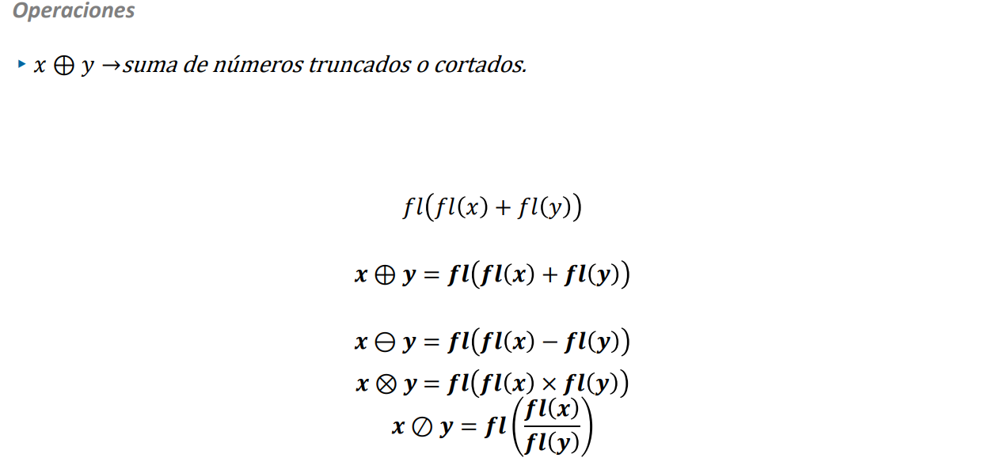

Donde fl es una funcion que hace la representacion del numero que se vaya usar, pero ya redondeado o truncado, la operacion se resume en que en cada operacion, el resultado se redondea o trunca segun lo que se necesite

Ese simbolo de las operaciones aritmeticas encerradas en un circulo, **representan una operacion con redondeo o truncado**

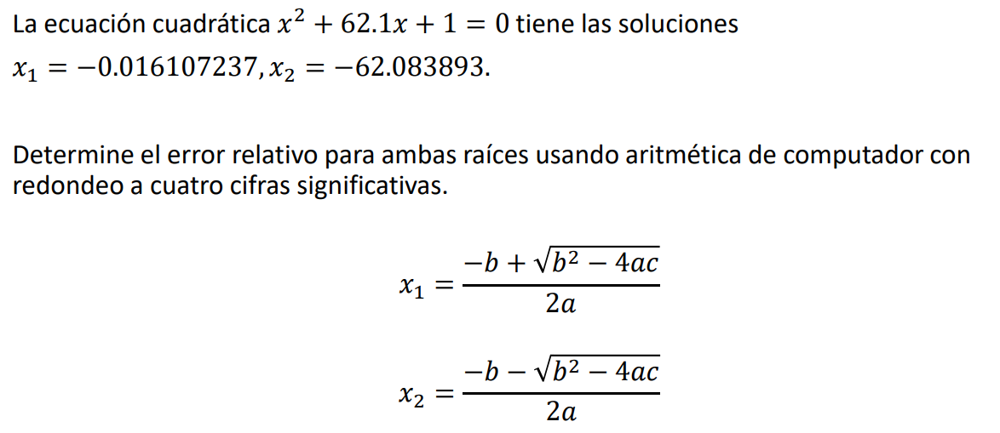

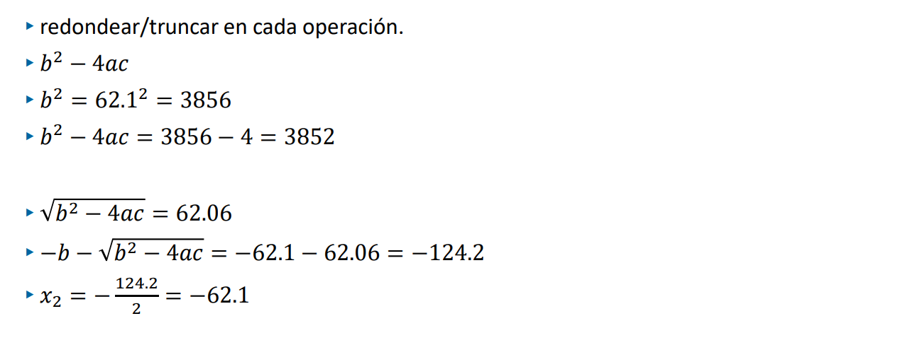

Como se observa en el procedimiento, en cada operacion que se vaya a realizar, se redondea su resultado, esto se aplica en cada paso de la operacion

- Si un numero resulta mas extenso de lo que se requirio, se redondea o se trunca, en este caso especifico se redondeo a cuatro cifras significativas

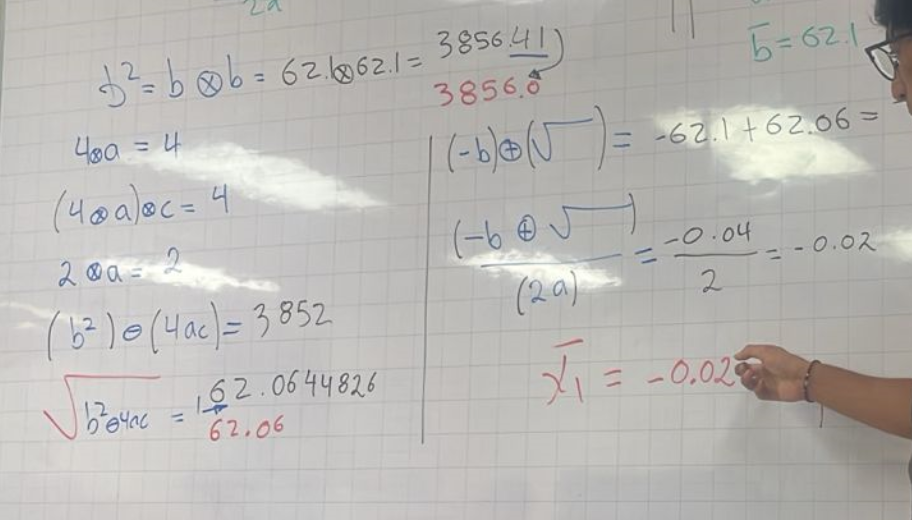

**SE DEBE REDONDEAR EN CADA OPERACION QUE SE VAYA A REALIZAR**

### Calculo del error relativo

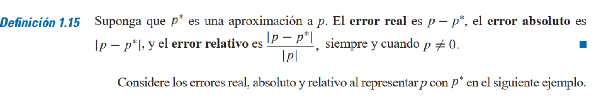

Para este caso, se calcula el error relativo de esta manera:

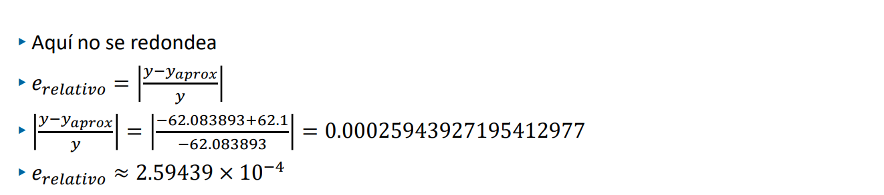

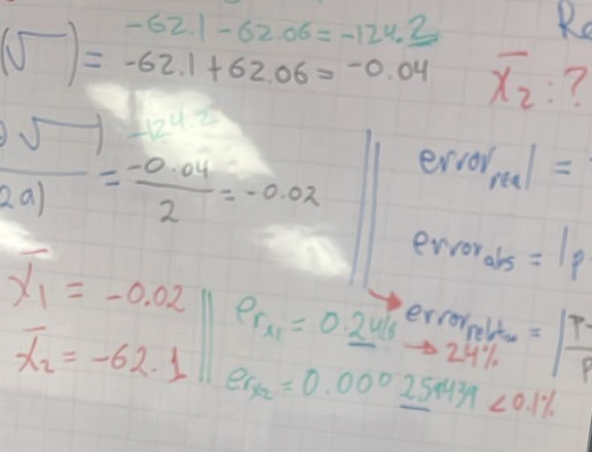

Otros ejercicios:

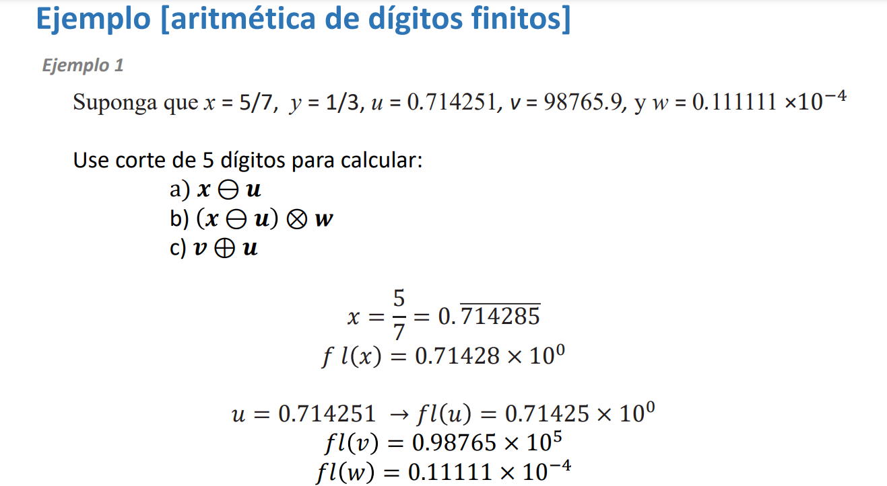

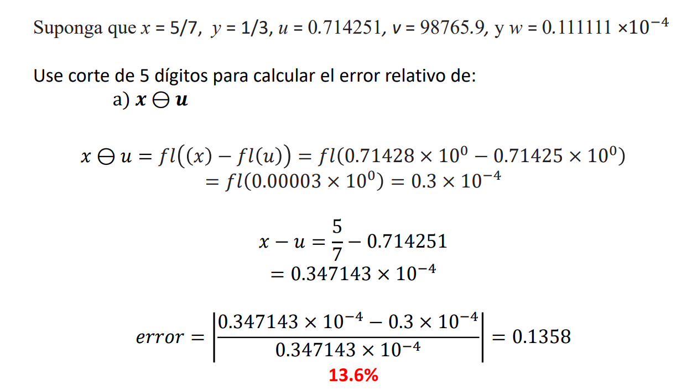

## Clase 28-04-2025

### Convergencia

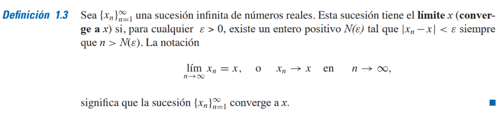

### Criterios de parada

Son  criterios que se utilizan para evitar que el algoritmo se ejecute indefinidamente, es decir, que no se detenga nunca. Estos criterios son importantes para garantizar que el algoritmo termine en un tiempo razonable y produzca un resultado útil.

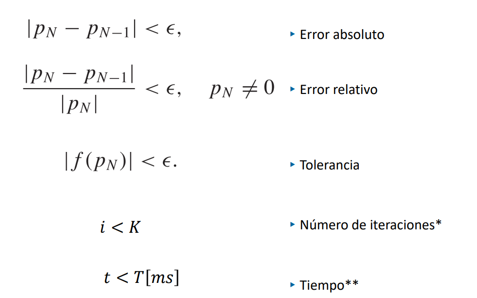

